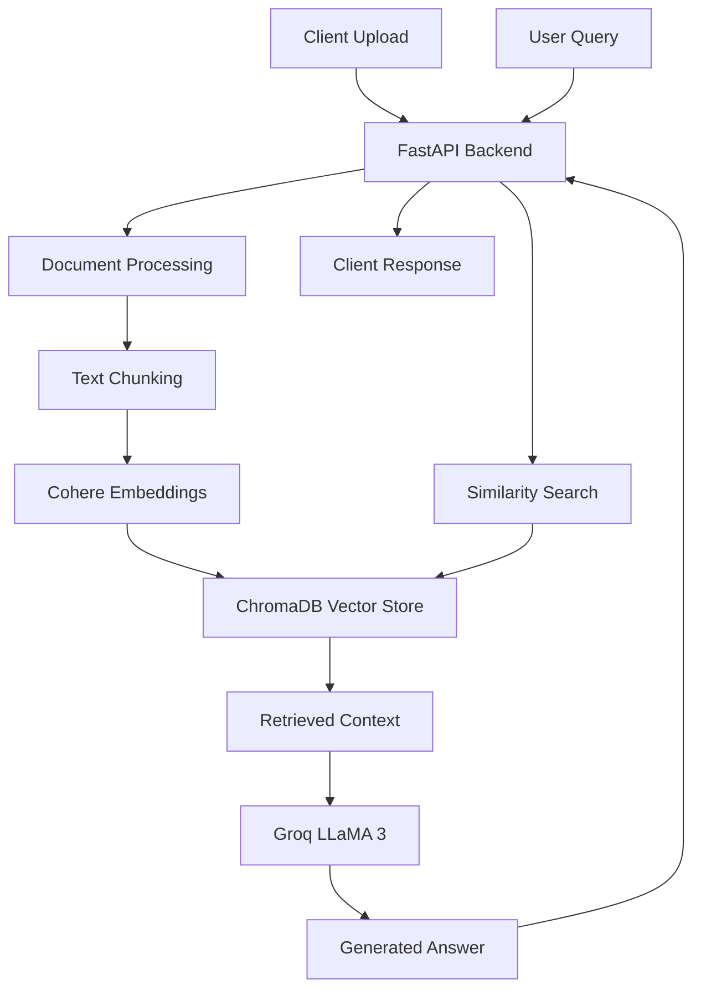

# 🔍 RAG API - Retrieval-Augmented Generation System

A powerful and scalable **Retrieval-Augmented Generation (RAG)** API that enables intelligent document querying using advanced AI models. Upload your documents and ask questions to get accurate, context-aware answers powered by Groq's LLaMA models and Cohere embeddings.

## ✨ Features

- **📄 Multi-format Document Support**: PDF, Text, and Markdown files
- **🧠 Advanced AI Integration**: Powered by Groq LLaMA 3 and Cohere embeddings
- **⚡ Real-time Processing**: Background document processing with FastAPI
- **🔍 Semantic Search**: ChromaDB vector database for efficient similarity search
- **🚀 Production Ready**: Docker containerization with resource limits
- **📊 Health Monitoring**: Built-in health checks and document metadata endpoints
- **🛡️ Robust Error Handling**: Comprehensive logging and error management

## 🏗️ Architecture



## 🚀 Quick Start

### Prerequisites

- Docker and Docker Compose
- API Keys:
  - [Groq API Key](https://console.groq.com/)
  - [Cohere API Key](https://dashboard.cohere.ai/)

### 1. Clone the Repository

```bash
git clone <your-repo-url>
cd rag-api
```

### 2. Environment Setup

Create a `.env` file:

```env
GROQ_API_KEY=your_groq_api_key_here
COHERE_API_KEY=your_cohere_api_key_here
```

### 3. Launch with Docker Compose

```bash
docker-compose up --build
```

The API will be available at `http://localhost:8000`

## 📚 API Endpoints

### 📤 Upload Documents
```http
POST /upload
Content-Type: multipart/form-data

Form Data:
- file: Document file (PDF, TXT, MD)
```

**Response:**
```json
{
  "id": "uuid-document-id",
  "status": "processing",
  "message": "Document is being processed in the background."
}
```

### ❓ Query Documents
```http
POST /query
Content-Type: application/json

{
  "question": "What is the main topic of the documents?"
}
```

**Response:**
```json
{
  "answer": "Based on the uploaded documents, the main topic is..."
}
```

### 📋 List Documents
```http
GET /documents
```

**Response:**
```json
{
  "documents": [
    {
      "doc_id": "uuid",
      "filename": "document.pdf",
      "source_type": "application/pdf",
      "chunk_count": 15
    }
  ],
  "total_unique_documents": 1
}
```

### 🏥 Health Check
```http
GET /healthz
```

**Response:**
```json
{
  "status": "ok",
  "indexed_documents": 5,
  "total_chunks_indexed": 150,
  "chroma_db_size_bytes": 1024000
}
```

## ⚙️ Configuration

### Limits & Parameters

| Parameter | Default | Description |
|-----------|---------|-------------|
| `MAX_DOCUMENTS` | 20 | Maximum number of unique documents |
| `MAX_CHUNKS_PER_DOC` | 100 | Maximum chunks per document |
| `MAX_DOCUMENT_FILE_SIZE_MB` | 10 | Maximum file size in MB |
| `CHUNK_SIZE` | 512 | Characters per text chunk |
| `CHUNK_OVERLAP` | 50 | Overlap between chunks |

### Supported File Types
- **PDF**: `.pdf` files
- **Text**: `.txt` files  
- **Markdown**: `.md` files

## 🔧 Development

### Local Development Setup

1. **Install Python Dependencies**
```bash
pip install -r requirements.txt
```

2. **Set Environment Variables**
```bash
export GROQ_API_KEY="your_key_here"
export COHERE_API_KEY="your_key_here"
```

3. **Run the Development Server**
```bash
uvicorn main:app --reload --host 0.0.0.0 --port 8000
```

### Project Structure

```
rag-api/
├── main.py              # FastAPI application
├── Dockerfile           # Container configuration
├── docker-compose.yml   # Multi-service setup
├── requirements.txt     # Python dependencies
├── .env                 # Environment variables
├── chroma_db/          # Vector database storage
└── README.md           # This file
```

## 🐛 Troubleshooting

### Common Issues

**Q: Getting "GROQ_API_KEY environment variable is required" error**
A: Ensure your `.env` file is in the project root and contains valid API keys.

**Q: Documents not being processed**
A: Check the logs with `docker-compose logs app` to see processing status and any errors.

**Q: Out of memory errors**
A: Reduce `CHUNK_SIZE` or `MAX_CHUNKS_PER_DOC` in the configuration, or increase Docker memory limits.

**Q: ChromaDB connection issues**
A: Ensure the ChromaDB service is running and the volume is properly mounted.

### Debugging

Enable detailed logging by setting the log level:
```python
logging.basicConfig(level=logging.DEBUG)
```

## 🚀 Deployment

### Production Deployment

1. **Use a reverse proxy** (nginx/traefik) for SSL termination
2. **Set up persistent volumes** for ChromaDB data
3. **Configure resource limits** based on your infrastructure
4. **Set up monitoring** for health endpoints
5. **Use secrets management** for API keys

### Docker Compose Production Example

```yaml
version: '3.8'
services:
  app:
    build: .
    environment:
      - GROQ_API_KEY_FILE=/run/secrets/groq_api_key
      - COHERE_API_KEY_FILE=/run/secrets/cohere_api_key
    secrets:
      - groq_api_key
      - cohere_api_key
    volumes:
      - ./chroma_data:/app/chroma_db
    deploy:
      replicas: 2
      resources:
        limits:
          memory: 4G
          cpus: 2.0

secrets:
  groq_api_key:
    file: ./secrets/groq_api_key.txt
  cohere_api_key:
    file: ./secrets/cohere_api_key.txt
```

## 🤝 Contributing

1. Fork the repository
2. Create a feature branch: `git checkout -b feature/amazing-feature`
3. Commit your changes: `git commit -m 'Add amazing feature'`
4. Push to the branch: `git push origin feature/amazing-feature`
5. Open a Pull Request

## 📄 License

This project is licensed under the MIT License - see the [LICENSE](LICENSE) file for details.

## 🙏 Acknowledgments

- [FastAPI](https://fastapi.tiangolo.com/) - Modern, fast web framework
- [LangChain](https://langchain.com/) - LLM application framework
- [ChromaDB](https://www.trychroma.com/) - Vector database
- [Groq](https://groq.com/) - High-performance AI inference
- [Cohere](https://cohere.ai/) - Advanced embeddings

## 📞 Support

For support, please open an issue on GitHub or contact the maintainers.

---

**Made with ❤️ for the AI community**
